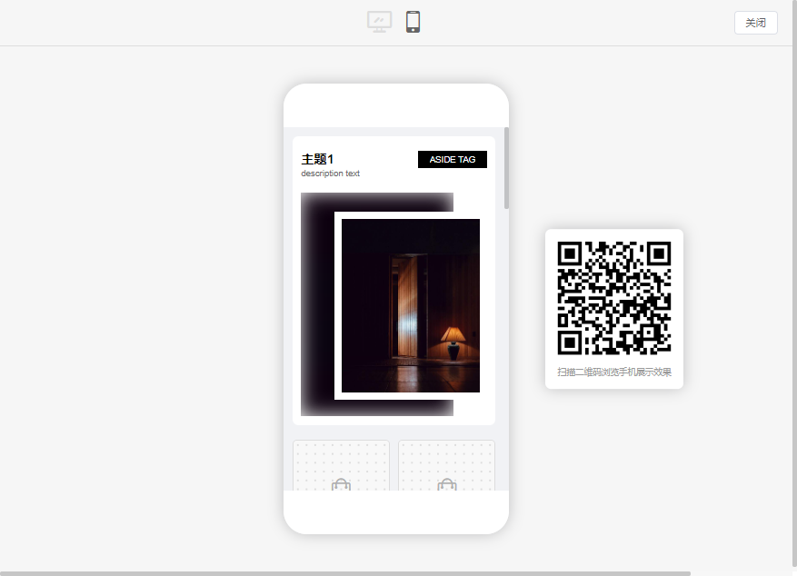
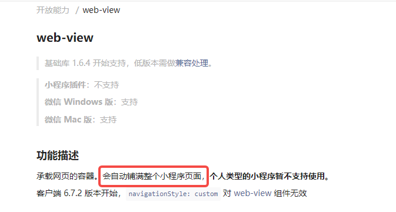
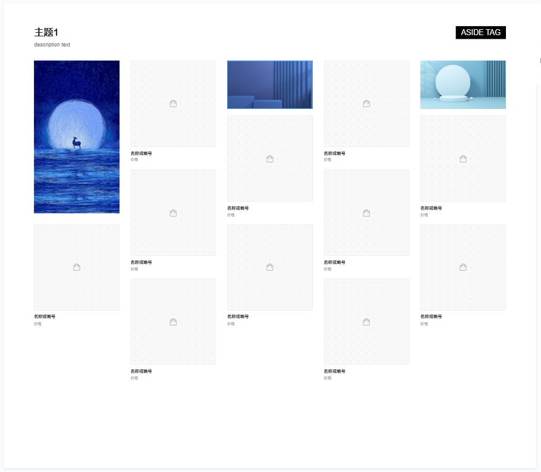
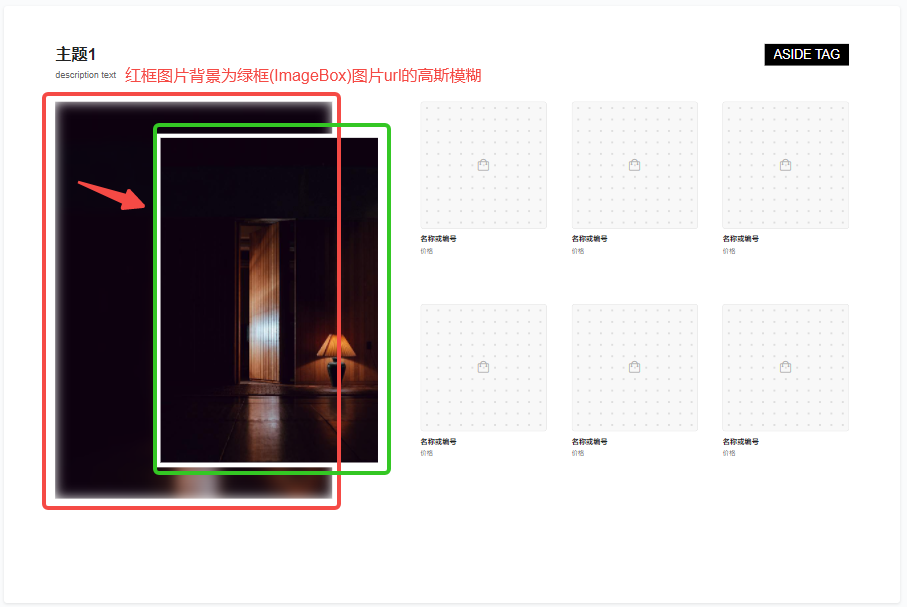
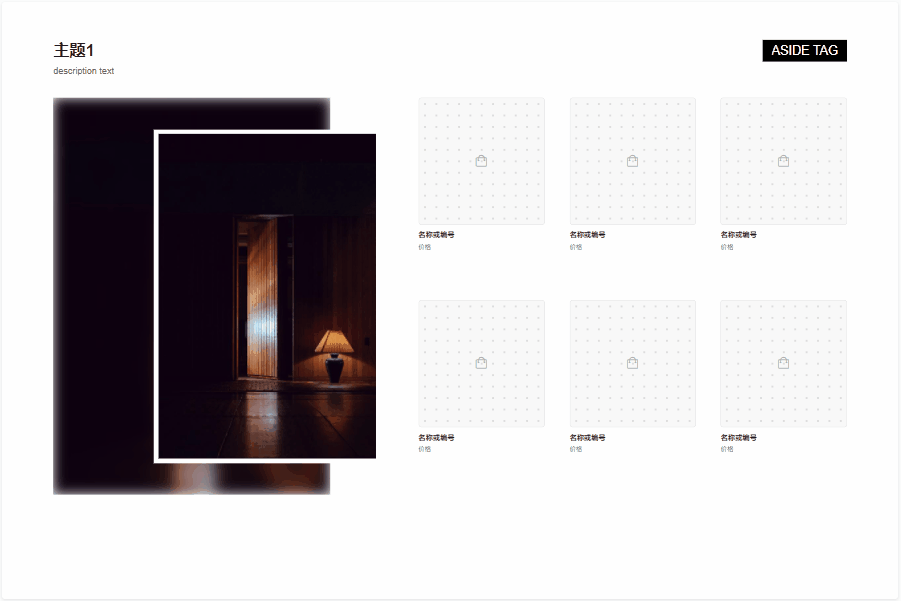
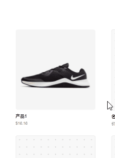
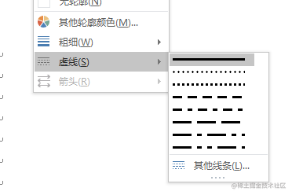
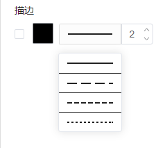
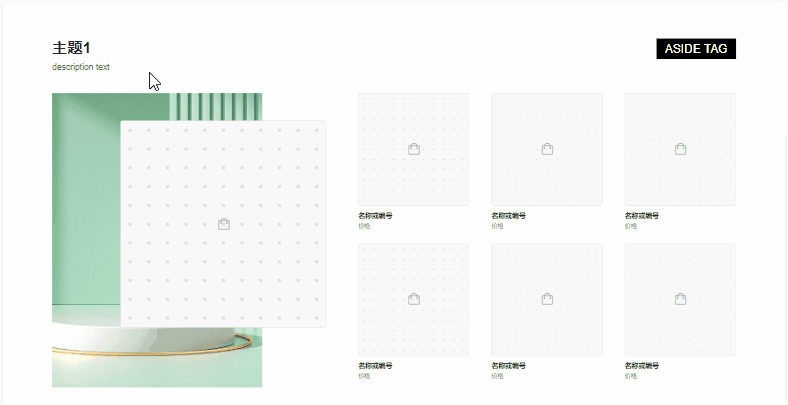
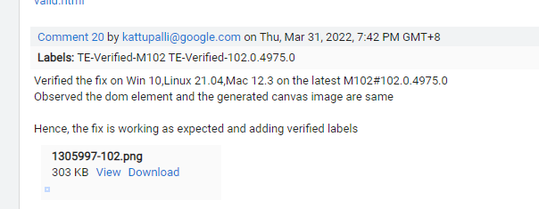

# 一个模块化+低代码的页面生成器的开发记录（要点+BUG篇）

系列目录
- [一个模块化+低代码的页面生成器的开发记录(原理篇)](https://github.com/zx69/front-end-articles/blob/main/modular-webpage-builder/article.md)
- [一个模块化+低代码的页面生成器的开发记录(要点+BUG篇)](https://github.com/zx69/front-end-articles/blob/main/modular-webpage-builder/article-2.md)

(接上文)

## 多平台响应式方案
我司该项目实际上为多端平台，包含Web/小程序/APP/MS-Teams/Adobe等，所以开发时需要考虑编辑后如何在多端展示。

#### 1. 移动端(除小程序)处理

如前所述，本项目中模块的JSON定义支持设置移动端、分平台样式样式，所以默认支持移动端响应式，具体可以见【预览】窗口的移动端效果：



既然已支持响应式，那么不难想到，其他非浏览器端的平台，最简单的方式是使用WebView，直接嵌入H5的页面。通常的店铺主页，除了自定义的部分，还会有一些固定不变的组成部分，如头部Banner，底部Tabbar等，以美的旗舰店的京东主页为例：

<p align="center">
  
</p>

本项目编辑器生成的页面，其实只展示在上图中间的【自定义区域】，顶部和底部的小程序是各店铺通用的，由其他逻辑生成。如果采用WebView方案，可在中间【自定义区域】设置一个WebView窗口，直接指向web端页面即可。我司APP端也是这样实现的。

#### 2. 小程序端处理
然而这种方案在小程序上碰壁了。因为小程序的web-view有个强制规定:

<div align="center">
  
</div>

即小程序的WebView必须是全屏的，无法设置大小，这与上面分析的需求不符。理论上也许可以使用`<cover-view>`等方案局部覆盖实现,但效果显然好不到哪里去。所以WebView方案在小程序端行不通，需要另外实现一套小程序的渲染逻辑。

由于我们项目采用了`JSON => DOM`的方案，这种分层思想类似于`React Native`的逻辑，将结构抽象成的JSON后，只要各端处理好实现从节点到DOM的渲染，那边就能实现一次编辑、多端展示了。且小程序的DOM属性原本就与Web端的大致兼容（我司小程序使用Taro,所以也是基于`vue`），所以解决方案其实很简单： 
  1. 将Web端compiler流程相关代码复制到小程序端，然后在schema规范化时，将Web端的`tagName`改成`View`:
  ```javascript
  // （其他逻辑详见上文的normalizeStrategies）
  import { View, Text } from '@tarojs/components';
  // 规范化nodeSchema策略集合（策略模式）
  const normalizeStrategies = {
    module(nodeSchema: CommonCompProp) {
      return {
        tagName: View,
        ...objUtil.pick(nodeSchema, ['style', 'class']),
        children: nodeSchema.children || [],
      };
    },
    block(nodeSchema: CommonCompProp) {
      return {
        tagName: View,
        ...objUtil.pick(nodeSchema, ['style', 'class']),
        children: nodeSchema.children || [],
      };
    },
    ...
  };

  ```
  2. 对各种组件元素（`type： 'component'`）进行改写.基本上只需要将`InputableText`/`ImageBox`/`ProductBox`等组件复制一份到小程序端，然后将`<template>`里的元素都改成`<view>/<text>`等即可。另外因为小程序端的元素都是只读，所以还可以把组件里的编辑逻辑去掉，然后再微调一下就可以了。如`ImageBox`在小程序端的组件如下：
  ```HTML
  <template>
    <view style="width: 100%; height: 100%;">
      <view class="webpage-builder_image-box image-container"
        :style="{
          backgroundImage: imageType === 'background' ? `url(${croppedImgFullUrl})` : 'unset',
        }"
      >
        <base-image :src="croppedImgFullUrl" v-if="imageType === 'image'"></base-image>
      </view>
    </view>
  </template>
  <script lang="ts">
  import {
    defineComponent, reactive, computed, ref, toRefs, PropType,
  } from 'vue';
  import { getModuleData } from '../utils';
  import { stringifyUrl } from '@/utils/oss/process';
  export default defineComponent({
    name: 'webpage-builder_image-box',
    components: {},
    props: {
      ... // 同web端
    },
    setup(props, { emit }) {
      const state = reactive({
        currentImagePath: getModuleData(props.data, props.valueKey),
      });
      const croppedImgFullUrl = computed(() => {
        return props.ossCropConfig ? stringifyUrl({
          url: state.currentImagePath,
          process: { image: { crop: props.ossCropConfig } },
        }) : state.currentImagePath;
      });
      return {
        ...toRefs(state),
        croppedImgFullUrl,
      };
    },
  });
  </script>
  <style lang="scss">
  .webpage-builder_image-box{
    background-size: cover;
    background-repeat: no-repeat;
    background-position: center;
    &.image-container {
      width: 100%;
      height: 100%;
    }
  }
  </style>
  ```


## 自定义新的module

为方便理解及生成模块，我另外开了个新页面，简单写了在线**模块生成器**，地址为：[模块生成器](https://zx69.github.io/modular-webpage-builder/#/moduleEditor)。代码中已经使用[require.context](https://webpack.js.org/guides/dependency-management/#requirecontext)实现了对`src/views/builder/modules`目录下`module`开头的文件的自动引入，生成后将JSON复制下来，放到`src/views/builder/modules`文件夹下，则新增模块会自动增加到编辑器左侧的模块列表中。


## CSS样式的局限
与其他低代码平台一样，低代码意味着低灵活性。出于简化的统一的需要，本项目的JSON-Schema不包含JS逻辑，如上文所述，所有模块的布局样式均使用纯CSS实现，只有组件元素内支持使用JS逻辑。这意味着目前模块只支持不特别负责的布局，目前预设模块最复杂的大概是这种类型的(`modules/module11`)：


<div align="center">
    
</div>


更复杂的布局，比如瀑布流等需要JS参与的布局，当前方案不支持。如果有这种需求，可以考虑将瀑布流区域设为组件元素来解决。

## CSS中包含变量
模板样式中存在一种特殊情况：CSS代码中包含变量。以`modules/module4`为例：

<div align="center">
    
</div>

上图中绿框为一个图片组件`ImageBox`, 红框为一个普通的`div`,其`backgroundImage`属性值即为绿框图片`src`，并进行高斯模糊。

<div align="center">
    
</div>

这个处理流程涉及一个之前的遗留点：如何在代码里插入动态变量并响应更新。

之前的`comilpeSchema`流程是将`style`属性视为静态json，直接赋值给`h`函数，这样的样式是不会动态更新。目前一个简单粗暴的处理方式是:

  1. 对`style`中的变量用特殊符号表示。参考amis的[模板字符串](https://aisuda.bce.baidu.com/amis/zh-CN/docs/concepts/template)方案, 使用`${xxx}`进行标识:
  ```javascript
    backgroundImage: 'url(${imgUrl})';
  ```
  2. 在`comilpeSchema`阶段对`style`属性进行遍历，对`${xxx}`中的标识符进行变量替换
  ```javascript
    // 解析style属性中的变量;
    const parseStyleValue = (styleObj: Obj, data: Obj) => {
      const _style: Obj = {};
      Object.entries(styleObj).forEach(([key, val]) => {
        _style[key] = parseTplExpress(data, val);
      });
      return _style;
    };
    const comilpeSchema = (...) => {
      ...
      if (attrs.style && moduleData) {
        attrs.style = parseStyleValue(attrs.style, moduleData);
      }
      ...
    }
  ```

需要注意这并不是一种好办法。因为在本项目中使用的比较少（只有两处用到），所以简单处理了一下。视情况可考虑进行如下优化：

1. 目前的处理需遍历`schema`树的`style`对象，如果层级较多时性能可能会受影响。可以考虑参考`vue2`/`vue3`而方式，在第一次`compileSchema`时对依赖进行收集，来规避重复遍历。

2. 目前的`${xxx}`内只支持单个变量，不支持表达式计算或函数调用。如果有这样的需要，可考虑使用`eval`改写。

## 组件元素的事件拦截
前面说到，本项目的设计是以组件元素（`type:'component'`）作为最小编辑单位的，因此对于鼠标相关事件，如`hover`/`click`/`mousedown`等，此类元素应该以组件整体接收。以`hover`为例，只能`hover`到组件整体，组件内的子元素不可再选中：

<p align="center">
  
</p>

一开始尝试过事件捕获、hover延时等方案，效果都不好。经思考，最后使用自定义事件和dispatchEvent实现了，代码如下：

```javascript
// 捕获事件并重新抛出.按设计,组件类型应该作为一个整体接受事件, 即组件内部元素不可单独点击等.
// 所以对于type=component类型,在组件外层捕获响应事件, 并在组件外层以currentTarget重新抛出,
// 这样外面接受的的ev.target就是组件外层整体元素(currentTarget)了
export const getEventCatchAndThrowMap = (eventNames: string | string[]) => {
  const _eventNameList = Array.isArray(eventNames) ? eventNames : [eventNames];
  return Object.fromEntries(_eventNameList.map(evName => {
    return [
      evName,
      (ev: MouseEvent) => {
        if (ev.target !== ev.currentTarget) {
          ev.stopPropagation();
          const _ev = new Event(evName, { bubbles: true });
          ev.currentTarget?.dispatchEvent(_ev);
        }
      },
    ];
  }));
};

// 调用生成events-map
const events = props.status !== 'edit' ? null : getEventCatchAndThrowMap(['click', 'mouseover', 'mouseout', 'mousedown']);

// 监听：
<div class="inputable-text" v-on="events">
  ...
</div>
```

## 自定义border的dashed样式间距
设置边框的间距是文本/形状编辑器的常见需求。如word中：



这种需求在SVG中可通过`stroke-dasharray`和`stroke-dashoffset`实现，然后对于一般的DOM，CSS属性只提供了`dotted`、`dashed`等几种边框样式，却没提供自定义虚线边框的点间距功能。替代方案是使用`background`模拟（该方法会同时设置边框宽度`border-width`）：
```
// 计算模拟虚线边框的background属性：
const getBorderStyle = (color: string, solidRadio: string, unitLength: string, borderWidth = 2) => {
  return {
    backgroundImage: `linear-gradient(to right, ${color} 0%, ${color} ${solidRadio}, transparent ${solidRadio}),
        linear-gradient(to right, ${color} 0%, ${color} ${solidRadio}, transparent ${solidRadio}),
        linear-gradient(to bottom, ${color} 0%, ${color} ${solidRadio}, transparent ${solidRadio}),
        linear-gradient(to bottom, ${color} 0%, ${color} ${solidRadio}, transparent ${solidRadio})`,
    backgroundSize: `${unitLength} ${borderWidth}px, ${unitLength} ${borderWidth}px, ${borderWidth}px ${unitLength}, ${borderWidth}px ${unitLength}`,
    backgroundRepeat: 'repeat-x, repeat-x, repeat-y, repeat-y',
    backgroundPosition: 'top left, bottom left, top left, top right',
  };
};
// 属性下拉菜单列表：
const borderStyleOptions = [
  {
    value: 'solid',
    style: getBorderStyle('#222222', '100%', '20px'),
  },
  {
    value: 'long-dashed',
    style: getBorderStyle('#222222', '70%', '20px'),
  },
  {
    value: 'dashed',
    style: getBorderStyle('#222222', '70%', '10px'),
  },
  {
    value: 'dotted',
    style: getBorderStyle('#222222', '50%', '6px'),
  },
];
```
效果如下：



## 带contenteditable属性的容器滚动问题
本项目的文本输入组件`InputableText`是基于`contenteditable`属性来进行输入状态切换的。实际使用中发现了一个问题：当输入框容器高/宽固定，且输入文本超出输入框尺寸时，输入后切换回只读状态（`contenteditable=false`）后，显示的文本会停留在输入最后的输入位置，如下图：



该bug的原因是经`contenteditable`属性设置的元素本质上仍然是一个`block`容器，表现形式与一般`div`类似，切换`contenteditable`并不会修改其滚动位置。

参考该[问题讨论](https://stackoverflow.com/questions/33066877/scroll-back-on-unfocus-blur-of-contenteditable-element), 优化方案为：

```javascript
  /* InputableText.vue */
  // contenteditable状态切换前,将容器滚回初始位置
  const handleChange = () => {
    if (!inputRef.value) {
      return;
    }
    inputRef.value.style.overflow = 'scroll';
    inputRef.value.scrollTo(0, 0);
    inputRef.value.style.overflow = 'hidden';
    ...
  };
```


## grid-area属性在chrome99-102上的一个BUG
本项目的设计稿，UI大佬有点飘了，预设模板设计了大量web端和移动端页面元素顺序不一致的情况。为适配产品设计稿，本项目的模块大量使用了`grid`布局（web端和移动端页面元素顺序不一致的实现方案，据我了解CSS里要实现元素顺序的变动，除了`grid`外，好像就只有`flex`而`order`了吧？）。

然后因业务需要将页面的HTML生成为封面，我们使用了比较流行的[dom-to-image](https://github.com/tsayen/dom-to-image)库来处理。随后发现了一个浏览器的bug: 

**`Chrome V99 ~ v101`版本存在一个bug，对`grid-area`属性的序列化使用了“过于激进的处理方式”**，导致使用`dom-to-image`生成的图片中`grid`布局错乱了。

bug相关讨论：
- `https://bugs.chromium.org/p/chromium/issues/detail?id=1305997`
- `https://github.com/tsayen/dom-to-image/issues/410`

好在`Chromev102`版本已经修复了这个问题。



如果业务需要兼容上述版本的Chrome, 相关模板可能需要改用`flex`之类的css属性进行重写。
