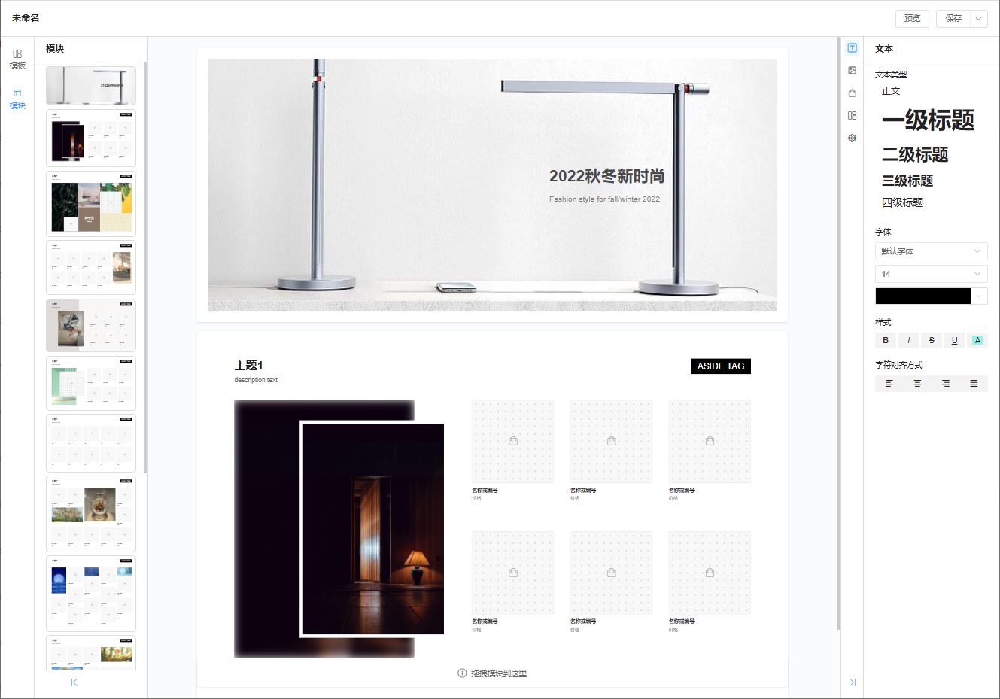
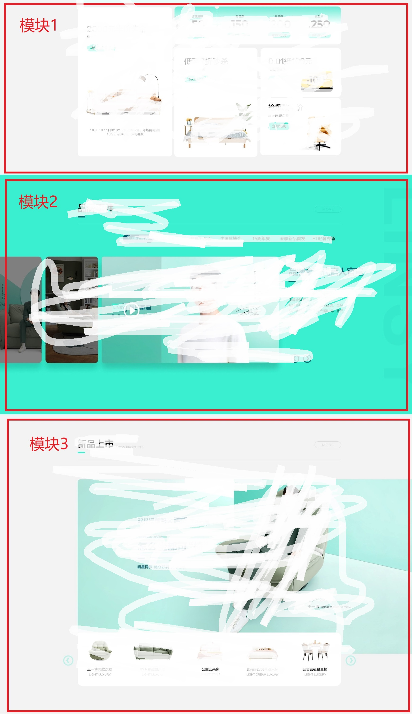
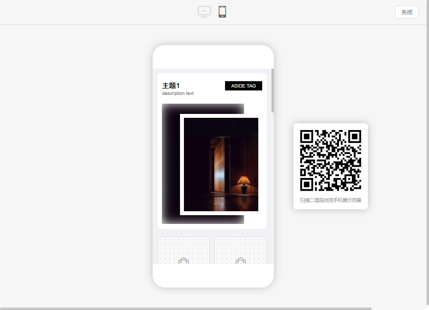
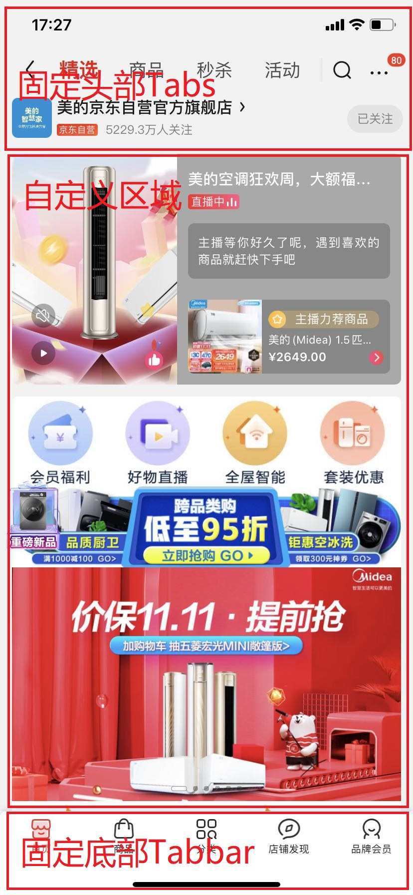
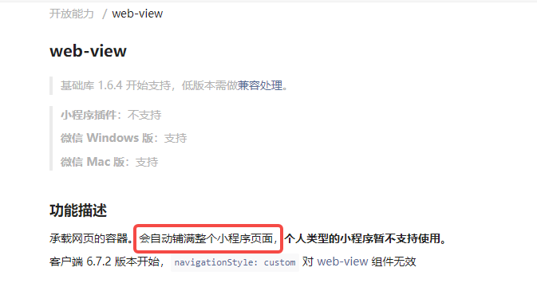

## 前言
前段时间刚好接到个需求，业务上需要开发一个低代码线上编辑器，用于卖家自定义店铺首页、以及生成宣传册\海报等附属功能。要求拖动生成，傻瓜式操作； 一次编辑，跨端响应式（web/h5/app/小程序）。独自一人折腾了半个月，基本完成第一版，自我感觉一路跨过了不少卡点，有一些值得分享的心得。所以就有了这篇文章。



- 演示版仓库地址：[modular-webpage-builder](https://github.com/zx69/modular-webpage-builder) 
- 在线预览：[demo](https://zx69.github.io/modular-webpage-builder/index.html)
- 在线模块生成器：[module-editor](https://zx69.github.io/modular-webpage-builder/#/moduleEditor.html)

因个人水平有限, 如代码中有bug, 或存在可以优化的内容, 欢迎指正和issue. 如果该项目对你有所帮助,欢迎Star~

> 在线预览速度可能比较慢，建议梯子或者下载到本地启动。时间有限就不搞gitee版本了   


## 技术栈
- 本项目使用`vue-cli`初始化，主要基于 [vue3](https://github.com/vuejs/core)技术栈 + [Typescript](https://github.com/microsoft/TypeScript) + [element-plus](https://github.com/element-plus/element-plus) 实现。
    - 本项目初始开发时，vue3-setup语法糖还没出来，所以本项目没有采用，只用了基础的`composition-api`。
    - 其中`element-plus`使用的不多，根据自身需要可自行替换为其他UI框架。
    - 因为时间有限（以及懒），`element-plus`为全量引入，没做按需加载，打包后vendors体积稍大(`chunk-vendors`大约1MB，其中`element-plus`占了2/3)。大家可自行处理。

- 演示Demo为Github Pages页面，数据是临时自己mock的。


<!--## 我对低代码的理解-->
<!--低代码, 从一开始的风口，到现在似乎逐渐鸡肋化了。个人认为，低代码平台有两个需解决的问题：-->
<!--1. 需要开发全链路(业务-产品-UI-开发)都能按统一规范执行。低代码必然导致低灵活性，如果开发的上游部门（业务、产品、UI）有任一方对开发成功的要求超出了平台的功能界限，且不可妥协，那就只能弃置低代码，手动开发了。  -->

<!--2. 通用性与其复杂程度、学习成本呈指数增长。也许真的能开发出一个通用于全部类型的自动生成网站的平台，但可想而知必定非常复杂，且学习成本高昂，实用性不高。-->

<!--综上，个人认为目前真正实用的低代码平台，应该是针对某个特定的、局部的功能进行专门低代码化。例如传统的博客网站生成系统WordPress等CMS系统, 针对管理后台的 [amis](https://github.com/baidu/amis)(其实这个项目也已经有点过分复杂了，有一定的学习成本，估计非开发者用的人也不多)等。  -->
<!--本项目也是基于这个思路设计的，基于一个完整项目的局部功能而定制的，一个非常基础的,勉强跟低代码沾边的功能。~~-->

## 模块化布局
本项目主要是基于模块化布局实现，个人认为对于大多数展示类网站而言，这是一种比较实用的方案。以天猫/京东随意找的两个店铺首页为例:
<div style="display:flex;">
  <div style="width:50%;text-align:center;">
    
    <div style="text-align:center">林氏木业</div>
  </div>
  <div style="width:50%;text-align:center;">
    
    <div style="text-align:center">美的</div>
  </div>
</div>
<!-- <table>
<td>

<div style="text-align:center">林氏木业</div>
</td>
<td>

<div style="text-align:center">美的</div>
</td>
</tr>
</table> -->

由上图可知，从上到下分模块垂直布局是当前展示类网站比较通用的方案:

<div style="text-align:center;">
    
    <div style="text-align:center">林氏木业网页分析</div>
</div>

<!--  -->
同时预设模块上可默认添加响应式样式布局规则，从而可以自动实现响应式。

在我司实际项目上，该功能实际上有两个迭代版本：
- V1.0版本为固定预设模板，拖动填充内容元素；
- V2.0版本增加了自由画布模板，可自由拖动、缩放元素到空白的自定义模板。  

目前很多低代码平台的Demo，使用的是类似上述V2.0的自由拖动画布，类似于一个线上PS编辑器，但这种方案生成的布局，在移动端上只能机械地缩放，无法实现有效的响应式，只适用于一些不需要考虑响应式的功能，比如宣传海报等（e.g. [搞定设计](https://www.gaoding.com/design)）。而我司该功能上线后的实践也证明了这一点：几乎的商家都是直接使用了固定模板，自由模板鲜少使用。

本项目目前只包含了V1.0版，也就是固定预设模板的部分。如果大家有兴趣，我再找个时间加上V2.0自由模板的部分。


## 关于低代码逻辑
在正式开发之前，需要把一些问题先想清楚。 

<!-- #### 低代码的内部逻辑
所谓的低代码，我的理解是，由于DOM元素的特性天生不利于存储和传输，且只支持有限的编辑，所以低代码的本质是将DOM转换成其他轻量级的、且可存储动态数据的数据结构类型（如JSON/YAML等，前端一般使用JSON）,从而方便编、存储和重新渲染。AST和虚拟DOM的出现，给低代码的流行拓宽了思路：采用分层思想，将结构和数据存储成中间层，再按需渲染成不同平台的DOM结构，从而实现一次编辑，多端使用。 -->

#### 低代码的处理流程
对于低代码平台的处理流程，我的理解应该包含两个层次:
- **步骤1**-对于编辑者：对外展示为一个编辑器视图，将视图层的输入，以某种规则转换为统一的Schema数据格式（前端通常以JSON保存），用来记录视图输入的配置和数据内容。
- **步骤2**-对于查看者：将步骤1生成的JSON-Schema，以相反的规则，利用 **Vue的渲染函数** 机制，转换成查看视图，同时兼顾响应式等。


本项目基于模块化，所以步骤1比较简单，定义好JSON数据结构后，按规则生成一串JSON数组即可。主要难点有两个：
1. 确定JSON-Schema的数据结构。
2. 将Schema转换成Vue-render函数的处理流程。

下面两节分别讲这两个问题

## JSON-Schema数据结构定义
对应于上图可知，初始开发前需要确认一个关键问题：JSON的数据结构。这个就如同框架的api体系，是个容易忽略，但其实非常关键的问题，如果数据结构没确认好，后续的转换和解析步骤都会受影响。  

从实现方式上看，**Schema的结构应该是类似多级树形的json, 由父子级关系串联而成，且每一级节点的结构应该类似，以便在解析时可以利用递归来生成Vue渲染函数**。  

有一个偷懒的方式是直接参考成熟框架的方案，毕竟是经历了许多实际项目的考虑。本项目就是参考了百度[amis](https://github.com/baidu/amis)项目的api, 并进行了许多简化。ts定义如下：
``` javascript
// 元素节点类型
export type SchemaType = 'module' | 'block' | 'component';
// 通用的元素节点定义
export type CommonCompProp<T extends SchemaType = SchemaType> = {
  // 元素类型定义
  type: T,
  // 模块数据，仅type=module
  data: T extends 'module' ? {
    [key: string]: unknown,
  } : undefined,
  // 元素类型，仅type=component
  component: T extends 'component' ? ((keyof typeof moduleComponentsMap) | ((data: Obj, attrs: Obj) => VNode)) : undefined,
  // 元素节点的props，仅type=component
  props: T extends 'component' ? Obj : undefined,
  class?: string,
  style?: {
    [key: string]: string,
  },
  // 用户自定义的style, 只在编辑时使用, 预览时合并入style再渲染
  customStyle?: {
    [key: string]: string,
  },
  // H5端响应式定义，可包含CommonCompProp的任一属性，在H5端时将覆盖相应的同名属性
  mobile?: CommonCompProp<T>,
  // 微信端响应式定义，可包含CommonCompProp的任一属性，在微信端时将覆盖相应的同名属性
  weixin?: CommonCompProp<T>,
  // 当前元素可激活的操作面板
  operation?: string | false,
  // 在模块列表中的排列序号，仅type=module
  index: T extends 'module' ? number : undefined,
  // section ID，仅type=module
  sid: T extends 'module' ? string : undefined,
  // module ID，仅type=module
  mid: T extends 'module' ? string : undefined,
  // 模块高宽比，仅type=module
  aspectRadio: T extends 'module' ? string : undefined,
  // 子元素，仅type!=component
  children: T extends 'component' ? undefined : (string | (CompBlock | CompComponent)[]),
};
```

个别说明如下：  
#### type： 'module' | 'block' | 'component'
json节点元素的类型。一开始仿造`amis`定义了很多种元素类型，但后面发现大多数用不上，因为`amis`面向非开发人员，许多布局都需要定义一种类型。而本项目的schema是由开发人员编写，很多基于样式增加的元素（比如`amis`的`flex`元素）完全可以用`CSS`实现，不需要自定义新类型。经过简化，最后划分为以下几种类型： 
    
    ├── module // 模块元素
    ├── block  // 布局元素
    └── component  // 组件元素
        ├── InputableText  // 可编辑文本
        ├── ImageBox  // 图片元素
        ├── ProductBox  // 商品元素
        ├── VideoBox  // 视频元素
        └── ...
##### 1. `type： 'module'` 模块元素
- 本项目基于模块化，其中每个模块都是一个`module`, 所以JSON数组第一层元素的类型均为`module`，且只有第一层可定义为`module`。
- 可包含`data`属性. `data`为整个模块的自定义数据集合（不含自定义样式），渲染时会注入到各个`component`组件元素
- 包含`sid`/`mid`/`index`/`apsectRadio`等专有属性

##### 2. `type： 'block'` 布局元素
类似于`div`元素, 主要用于划分布局，以及作为其他非`module`元素的容器。可设置背景色。

##### 3. `type： 'component'` 组件元素
- 可编辑的最小单位元素
- 内部可包含js逻辑，解析时会注入props和data。
- 包含`component`属性，用于定义具体的组件类型。详见下文。

#### component： 'InputableText' | 'ImageBox' | 'ProductBox' | ...
组件元素（`type： 'component'`）特有属性，定义具体的组件类型名称。因为Vue组件实际上是函数，如果直接保存组件将不利于JSON化。所以用字符串组件名表示特定组件。本项目Demo只包含3种类型的组件：
##### 1. `InputableText`(可编辑文本)
- 一般的文本/标题.编辑阶段双击显示为输入框, 预览阶段显示为纯文本;基于contenteditable属性实现.
##### 2. `ImageBox`(图片盒子)
- 接收图片拖入的容器.聚焦时会出现[裁剪图片]按钮
##### 3. `ProductBox`(商品盒子)
- 业务需要的商品的单元组件.因本Demo展示的是店铺首页, 通常将包含大量商品平铺图,所以提供该元素展示. 可根据业务需要自行替换.

可根据项目需要自行扩展新的元素类型，只需在`moduleComponentsMap`属性下注册即可
```javascript
// src/views/builder/modules/index.ts
export const moduleComponentsMap = {
  InputableText,
  ProductBox,
  ImageBox,
};
```

#### customStyle： {[key: string]: string}
用户自定义的样式。与其相对应的是`style`,定义模块的默认样式。之所以与`style`属性区分开来，是因为预览时支持切换PC/移动端平台，如果直接将用户自定义样式覆盖到`style`上,样式混淆后将无法根据平台合并各种样式，影响响应式。所以区分开。

#### mobile/weixin： CommonCompProp<T>
H5端/微信端定制的配置项，可包含Schema的任一属性，在特定平台下将覆盖相应的同名属性。例如：
```json
{
    ...
     "style": {
        "color": "red", // PC端下将使用该样式
    },
    "mobile": {
        "style": {
            "color": "blue", // H5端下该样式会覆盖style属性，从而使用该样式
        }
    },
}
```
如果需要针对其他平台另外定义特定配置和样式，只需自行添加新项及处理逻辑即可，如基于APP, 可定义一个`app`的属性, 来定义专用于App的样式。

> NOTE:  
> 1. 对于移动端的判断, 主流有两种方式，一是根据页面宽度，二是根据userAgent。两种各有优劣，本项目按我司惯例采用的是第二种。如果需要采用第一种，可自行修改`getPlatform`函数定义。
> 2. 对微信端的判断。采用`userAgent.includes('miniProgram')`

#### operation: string | false
元素对应的自定激活右侧面板。如WPS/Office常用的交互，当点击一个文本时，会激活【开始】面板；当点击一个图片时，会激活【格式】面板：  

该属性就是用于定义要激活的属性名。默认情况下，组件元素（`type： 'component'`）已经在`$options`上预设了该属性，无需额外设置：
```
InputableText => 'text'面板
ProductBox => 'product'面板
ImageBox => 'image'面板
```
如果需要对其他类型的元素（如`block`元素）定义默认激活面板，或者要覆盖组件元素默认定义的激活面板，则可在相应Shema节点上定义该属性。

其他具体细节详见项目代码。


## JSON-Schema to DOM
如前所述，JSON-Schema渲染成DOM的核心思路，是使用Vue的渲染函数（h函数）。由于h函数的入参与Schema有所差异，在此之前，要先对Schema进行配置项的计算、规范化及归并。简化后的compiler逻辑如下：
```javascript
// 规范化nodeSchema策略集合（策略模式）
const normalizeStrategies = {
  module(nodeSchema: CommonCompProp) {
    return {
      tagName: 'div',
      ...objUtil.pick(nodeSchema, ['style', 'class']),
      children: nodeSchema.children || [],
    };
  },
  block(nodeSchema: CommonCompProp) {
    return {
      tagName: 'div',
      ...objUtil.pick(nodeSchema, ['style', 'class']),
      children: nodeSchema.children || [],
    };
  },
  component(nodeSchema: CommonCompProp, currentStatus: RenderStatus) {
    return {
      tagName: '',
      ...objUtil.pick(nodeSchema, ['style', 'class', 'props']),
      component: nodeSchema.component,
      status: currentStatus,
      children: undefined,
    };
  },
};

// 将JSON-Schema转换为h函数
const comilpeSchema = (
  nodeSchema: CommonCompProp<SchemaType>, // schema
  renderData?: Obj, // module的data
  parentAttrs?: Obj | null, // 父节点传入子节点的属性
  config: { mode: PreviewMode, status: RenderStatus } = { mode: 'pc', status: 'preview' }, // 配置选项
): VNode => {
  ...

  // 规范化策略
  const normalizeStrategy = normalizeStrategies[nodeSchema.type];
  // schema规范化
  const vnode = normalizeStrategy(nodeSchema, config.status);

  // 模块汇总的data
  const moduleData = isModule(nodeSchema) ? nodeSchema.data : renderData;
  ...

  // 子元素为组件时
  if (isComponent(nodeSchema)) {
    if (typeof nodeSchema.component === 'function') {
      return nodeSchema.component(moduleData || {}, attrs);
    }
    if (typeof nodeSchema.component === 'string' && moduleComponentsMap[nodeSchema.component]) {
      return h(moduleComponentsMap[nodeSchema.component], {
        ...attrs,
        data: moduleData || {},
        // @ts-ignore
        ...vnode.props,
      });
    }
  }

  const children = vnode.children ?? [];
  // 子元素为一般组件时
  return h(
    vnode.tagName,
    { ...attrs },
    typeof children === 'string'
      ? children
      : (children || []).map((_c => comilpeSchema(
        _c,
        moduleData,
        { ...parentAttrs, parentFid: fid ?? parentFid },
        config,
      ))),
  );
};

```
再定义一个模块Render组件来声明render函数即可（或者直接使用函数式组件）：
```javascript
// src/views/builder/editor/components/Renderer.ts
export default defineComponent({
  name: 'webpage-builder_generator_renderer',
  components: {
  },
  props: {
    ...
  },
  setup(props, { emit }) {
    return () => comilpeSchema(
      props.schema, 
      props.schema.data, 
      null, 
      { mode: props.previewMode, status: props.status }
    );
  },
});
```
至此，Schema => DOM的逻辑便完成了。使用时直接将`JSON`数据传入`<Render :schema="json" />`即可；每个`<Render>`组件即代表一个模块。

为方便理解及生成模块，我另外开了个新页面，简单写了在线**模块生成器**，地址为：[模块生成器](https://zx69.github.io/modular-webpage-builder/#/moduleEditor.html)。可以在上面修改代码，并实时预览，以了解模块的生成原理。

关于开发中遇到的部分技术要点，我后面另起一文讨论。

******

### 多平台响应式方案
我司该项目实际上为多端平台，包含Web/小程序/APP/MS-Teams/Adobe等，所以开发时需要考虑编辑后如何在多端展示。

#### 1. 移动端(除小程序)处理

如前所述，本项目中模块的JSON定义支持设置移动端、分平台样式样式，所以默认支持移动端响应式，具体可以见【预览】窗口的移动端效果：


既然已支持响应式，那么不难想到，其他非浏览器端的平台，最简单的方式是使用WebView，直接嵌入H5的页面。通常的店铺主页，除了自定义的部分，还会有一些固定不变的组成部分，如头部Banner，底部Tabbar等，以美的旗舰店的京东主页为例：

<div style="text-align:center;">
    
</div>

本项目编辑器生成的页面，其实只展示在上图中间的【自定义区域】，顶部和底部的小程序是各店铺通用的，由其他逻辑生成。如果采用WebView方案，可在中间【自定义区域】设置一个WebView窗口，直接指向web端页面即可。
我司APP端也是这样实现的。

#### 2. 小程序端处理
然而这种方案在小程序上碰壁了。因为小程序的web-view有个强制规定:

<div style="text-align:center;">
    
</div>

即小程序的WebView必须是全屏的，无法设置大小，这与上面分析的需求不符。理论上也许可以使用`<cover-view>`等方案局部覆盖实现,但效果显然好不到哪里去。所以WebView方案在小程序端行不通，需要另外实现一套小程序的渲染逻辑。

由于我们项目采用了`JSON => DOM`的方案，这种分层思想类似于`React Native`的逻辑，将结构抽象成的JSON后，只要各端处理好实现从节点到DOM的渲染，那边就能实现一次编辑、多端展示了。且小程序的DOM属性原本就与Web端的大致兼容（我司小程序使用Taro,所以也是基于`vue`），所以解决方案其实很简单： 
  1. 将Web端compiler流程相关代码复制到小程序端，然后在schema规范化时，将Web端的`tagName`改成`View`:
  ```javascript
  // （其他逻辑详见上文的normalizeStrategies）
  import { View, Text } from '@tarojs/components';
  // 规范化nodeSchema策略集合（策略模式）
  const normalizeStrategies = {
    module(nodeSchema: CommonCompProp) {
      return {
        tagName: View,
        ...objUtil.pick(nodeSchema, ['style', 'class']),
        children: nodeSchema.children || [],
      };
    },
    block(nodeSchema: CommonCompProp) {
      return {
        tagName: View,
        ...objUtil.pick(nodeSchema, ['style', 'class']),
        children: nodeSchema.children || [],
      };
    },
    ...
  };

  ```
  2. 对各种组件元素（`type： 'component'`）进行改写.基本上只需要将`InputableText`/`ImageBox`/`ProductBox`等组件复制一份到小程序端，然后将`<template>`里的元素都改成`<view>/<text>`等即可。另外因为小程序端的元素都是只读，所以还可以把组件里的编辑逻辑去掉，然后再微调一下就可以了。如`ImageBox`在小程序端的组件如下：
  ```HTML
  <template>
    <view style="width: 100%; height: 100%;">
      <view class="material-brochure_image-box image-container"
        :style="{
          backgroundImage: imageType === 'background' ? `url(${croppedImgFullUrl})` : 'unset',
        }"
      >
        <base-image :src="croppedImgFullUrl" v-if="imageType === 'image'"></base-image>
      </view>
    </view>
  </template>

  <script lang="ts">
  import {
    defineComponent, reactive, computed, ref, toRefs, PropType,
  } from 'vue';
  import { getModuleData } from '../utils';
  import { stringifyUrl } from '@/utils/oss/process';

  export default defineComponent({
    name: 'material-brochure_image-box',
    components: {},
    props: {
      data: {
        type: Object,
        required: true,
      },
      valueKey: {
        type: String,
        required: true,
      },
      imageType: {
        type: String as PropType<'image' | 'background'>,
        default: 'image',
      },
      // oss图片query参数对象
      ossCropConfig: {
        type: Object,
      },
    },
    setup(props, { emit }) {
      const state = reactive({
        currentImagePath: getModuleData(props.data, props.valueKey),
      });
      const croppedImgFullUrl = computed(() => {
        return props.ossCropConfig ? stringifyUrl({
          url: state.currentImagePath,
          process: { image: { crop: props.ossCropConfig } },
        }) : state.currentImagePath;
      });
      return {
        ...toRefs(state),
        croppedImgFullUrl,
      };
    },
  });
  </script>
  <style lang="scss">
  .material-brochure_image-box{
    background-size: cover;
    background-repeat: no-repeat;
    background-position: center;
    &.image-container {
      width: 100%;
      height: 100%;
    }
  }
  </style>
  ```

### 自定义新的module

为方便理解及生成模块，我另外开了个新页面，简单写了在线**模块生成器**，地址为：[模块生成器](https://zx69.github.io/modular-webpage-builder/#/moduleEditor.html)。代码中已经使用[require.context](https://webpack.js.org/guides/dependency-management/#requirecontext)实现了对`src/views/builder/modules`目录下`module`开头的文件的自动引入，生成后将JSON复制下来，放到`src/views/builder/modules`文件夹下，则新增模块会自动增加到编辑器左侧的模块列表中。
### CSS样式的局限
与其他低代码平台一样，低代码意味着低灵活性。出于简化的统一的需要，本项目的JSON-Schema不包含JS逻辑，如上文所述，所有模块的布局样式均使用纯CSS实现，只有组件元素内支持使用JS逻辑。这意味着目前模块只支持不特别负责的布局，目前预设模块最复杂的大概是这种类型的：

<div style="text-align:center;">
    
    <div style="text-align:center">模块11</div>
</div>

更复杂的布局，比如瀑布流等需要JS参与的布局，当前方案不支持。如果有这种需求，可以考虑将瀑布流区域设为组件元素来解决。

### grid-area属性在chrome99-102上的一个BUG
本项目的设计稿，UI大佬有点飘了，预设模板设计了大量web端和移动端页面元素顺序不一致的情况。为适配产品设计稿，本项目的模块大量使用了`grid`布局（web端和移动端页面元素顺序不一致的实现方案，据我了解CSS里要实现元素顺序的变动，除了`grid`外，好像就只有`flex`而`order`了吧？）。

然后因业务需要将页面的HTML生成为封面，我们使用了比较流行的[dom-to-image](https://github.com/tsayen/dom-to-image)库来处理。随后发现了一个浏览器的bug: 

**`Chrome V99 ~ v101`版本存在一个bug，对`grid-area`属性的序列化使用了“过于激进的处理方式”**，导致使用`dom-to-image`生成的图片中`grid`布局错乱了。

bug相关讨论：
- `https://bugs.chromium.org/p/chromium/issues/detail?id=1305997`
- `https://github.com/tsayen/dom-to-image/issues/410`

好在`Chromev102`版本已经修复了这个问题。如果业务需要兼容上述版本的Chrome, 相关模板可能需要改用`flex`之类的css属性进行重写。
