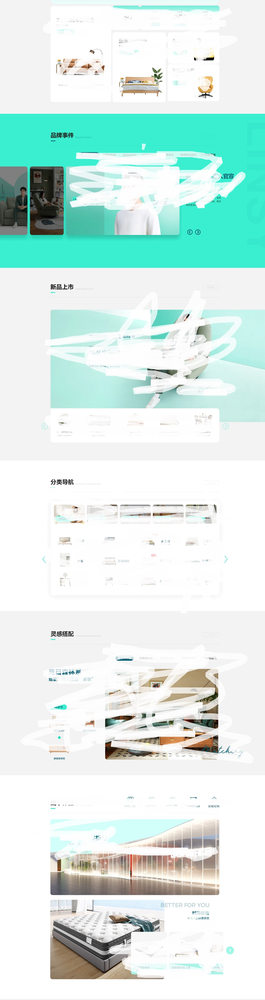

# 一个模块化+低代码的页面生成器的开发记录（原理篇）

系列目录
- [一个模块化+低代码的页面生成器的开发记录(原理篇)](https://github.com/zx69/front-end-articles/blob/main/modular-webpage-builder/article.md)
- [一个模块化+低代码的页面生成器的开发记录(要点+BUG篇)](https://github.com/zx69/front-end-articles/blob/main/modular-webpage-builder/article-2.md)
## 前言
前段时间刚好接到个需求，业务上需要开发一个低代码线上编辑器，用于卖家自定义店铺首页、以及生成宣传册\海报等附属功能。要求拖动生成，傻瓜式操作； 一次编辑，跨端响应式（web/h5/app/小程序）。独自一人折腾了半个月，基本完成第一版，自我感觉一路跨过了不少卡点，有一些值得分享的心得。所以就有了这篇文章。


- 演示版仓库地址：[modular-webpage-builder](https://github.com/zx69/modular-webpage-builder) 
- 在线预览：[demo](https://zx69.github.io/modular-webpage-builder/index.html)
- 在线模块生成器：[module-editor](https://zx69.github.io/modular-webpage-builder/#/moduleEditor)

因个人水平有限, 如代码中有bug, 或存在可以优化的内容, 欢迎指正和issue. 如果该项目对你有所帮助,欢迎Star~

> 1. 在线预览速度可能比较慢，建议梯子或者下载到本地启动。时间有限就不搞gitee版本了。
> 2. 本Demo演示图片均来源于网络，如有侵权请告知，将及时删除。  


## 技术栈
- 本项目使用`vue-cli`初始化，主要基于 [vue3](https://github.com/vuejs/core)技术栈 + [Typescript](https://github.com/microsoft/TypeScript) + [element-plus](https://github.com/element-plus/element-plus) 实现。
    - 本项目初始开发时，vue3-setup语法糖还没出来，所以本项目没有采用，只用了基础的`composition-api`。
    - 其中`element-plus`使用的不多，根据自身需要可自行替换为其他UI框架。
    - 因为时间有限（以及懒），`element-plus`为全量引入，没做按需加载，打包后vendors体积稍大(`chunk-vendors`大约1MB，其中`element-plus`占了2/3)。大家可自行处理。

- 演示Demo为Github Pages页面，数据是临时自己mock的。


## 模块化布局
本项目主要是基于模块化布局实现，个人认为对于大多数展示类网站而言，这是一种比较实用的方案。以天猫/京东随意找的两个店铺首页为例:

<table align="center">
  <td>
  
  <div style="text-align:center">林氏木业</div>
  </td>
  <td>
  
  <div style="text-align:center">美的</div>
  </td>
  </tr>
</table>


由上图可知，从上到下分模块垂直布局是当前展示类网站比较通用的方案:

<p align="center">
  
</p>


同时可以预先在每个模块上设置好响应式样式布局，从而自带响应式。

在我司实际项目上，该功能实际上有两个迭代版本：
- V1.0版本为固定模板，拖动填充内容元素；
- V2.0版本增加了自由模板，可元素可自由拖动、缩放。

目前很多低代码平台的Demo，使用的是上述V2.0版，元素可自由拖动的低代码形式，类似于一个线上PS编辑器，但这种方案生成的布局，在移动端上只能机械地缩放，无法实现有效的响应式，只适用于一些不需要考虑响应式的功能，比如宣传海报等（e.g. [搞定设计](https://www.gaoding.com/design)）。我司该功能上线后的实践也证明了这一点：几乎的商家都是直接使用了固定模板，自由模板鲜少使用。

本项目目前只包含了V1.0版，也就是固定预设模板的部分。如果大家有兴趣，我再找个时间加上V2.0自由模板的部分。


## 低代码的处理流程
在正式开发之前，需要把一些问题先想清楚。 

对于低代码平台的处理流程，个人理解包含两个层次:

- **步骤1**（transfer阶段）`视图层输入 => JSON`
  - 在编辑器上，将视图层各种元素的编辑操作，转换为统一的Schema数据格式（前端通常以JSON保存），并保存到数据库中。该Schema上记录了视图层输入的配置和数据。

- **步骤2**（compiler阶段）`JSON-Schema => h函数 => 视图输出`
  - 将步骤1生成的JSON-Schema，以相反的规则，转换为DOM可识别的格式，从而生成DOM,输出在页面上；
  - 具体到`Vue`框架，是借助**Vue的渲染函数**，将JSON转换成`h(...)`的格式，然后再生成DOM输出

<p align="center">
    
</p>

本项目基于模块化，所以步骤1比较简单，定义好JSON数据结构后，按规则生成一串JSON数组即可。主要难点有两个：

1. 确定JSON-Schema的数据结构。
2. 将Schema转换成Vue-render函数的处理流程。

下面两节分别讲这两个问题

## 定义JSON-Schema数据结构
对应于上图可知，初始开发前需要确认一个关键问题：JSON的数据结构。这个就如同框架的api体系，是个容易忽略，但其实非常关键的问题，如果数据结构没确认好，后续的转换和解析步骤都会受影响。  

实用的Schema的结构应该满足以下特点：
  1. 结构：多级树形的json, 由父子级关系串联而成，且每一级节点的结构应该类似，以便在解析时可以利用**递归**来生成Vue渲染函数。  
  2. 数据：最终页面必然包含一些动态数据，比如图片URL,标题文本等。这些数据的结构纪要便于存储，又要便于提取出来编辑。
  3. 样式：能以合理的信息合并默认样式和自定义样式，并适配多平台的响应式。

有一个偷懒的方式是直接参考成熟框架的方案，毕竟是经历过实践的考验。本项目就是参考了百度[amis](https://github.com/baidu/amis)项目的api, 并进行了许多简化。最终的元素节点的ts定义如下：

``` javascript
// 元素节点类型
export type SchemaType = 'module' | 'block' | 'component';
// 通用的元素节点定义
export type CommonCompProp<T extends SchemaType = SchemaType> = {
  type: T, // 元素类型定义
  data: T extends 'module' ? { 
    [key: string]: unknown,
  } : undefined, // 模块数据，仅type=module
  component: T extends 'component' 
    ? ((keyof typeof moduleComponentsMap) | ((data: Obj, attrs: Obj) => VNode)) 
    : undefined, // 元素类型，仅type=component
  props: T extends 'component' ? Obj : undefined, // 元素节点的props，仅type=component
  class?: string,
  style?: {
    [key: string]: string,
  },
  customStyle?: {
    [key: string]: string,
  }, // 用户自定义的style, 只在编辑时使用, 预览时合并入style再渲染
  mobile?: CommonCompProp<T>, // H5端响应式定义，可包含CommonCompProp的任一属性，在H5端时将覆盖相应的同名属性
  operation?: string | false,  // 当前元素可激活的操作面板
  children: T extends 'component' 
    ? undefined 
    : (string | (CompBlock | CompComponent)[]), // 子元素，仅type!=component
  ...
};
```

个别说明如下：  
#### 元素类型 type： 'module' | 'block' | 'component'
json节点元素的类型。百度[amis](https://github.com/baidu/amis)项目中包含了特别多的元素类型，本项目经过简化，最后划分为以下几种类型： 
    
    ├── module // 模块元素
    ├── block  // 布局元素
    └── component  // 组件元素
        ├── InputableText  // 可编辑文本
        ├── ImageBox  // 图片元素
        ├── ProductBox  // 商品元素
        ├── VideoBox  // 视频元素
        └── ...
#### 1. `type： 'module'` 模块元素
- 本项目基于模块化，其中每个模块都是一个`module`, 所以JSON数组第一层元素的类型均为`module`，且只有第一层可定义为`module`。
- 可包含`data`属性. `data`为整个模块的自定义数据集合（不含自定义样式），渲染时会注入到各个`component`组件元素
- 包含`sid`/`mid`/`index`/`apsectRadio`等专有属性

#### 2. `type： 'block'` 布局元素
类似于`div`元素, 主要用于划分布局，以及作为其他非`module`元素的容器。可设置背景色。

#### 3. `type： 'component'` 组件元素
- 可编辑的最小单位元素
- 内部可包含js逻辑，解析时会注入props和data。
- 包含`component`属性，用于定义具体的组件类型。详见下文。

#### 3.1 `component：'InputableText'`(组件-可编辑文本)
- 一般的文本/标题.编辑阶段双击显示为输入框, 预览阶段显示为纯文本;
- 基于contenteditable属性实现.
#### 3.2 `component：'ImageBox'`(组件-图片盒子)
- 接收图片拖入的容器.聚焦时会出现[裁剪图片]按钮
#### 3.3 `component：'ProductBox'`(组件-商品盒子)
- 业务需要的商品的单元组件.因本Demo展示的是店铺首页, 通常将包含大量商品平铺图,所以提取为组件元素.可根据业务需要自行替换.

可根据项目需要自行扩展新的组件元素类型，比如，针对视频的`VideoBox`元素, 针对链接的`LinkAnchor`元素等等。只需在`moduleComponentsMap`属性下注册即可。

```javascript
// src/views/builder/modules/index.ts
export const moduleComponentsMap = {
  InputableText,
  ProductBox,
  ImageBox,
};
```

#### data：{ [key: string]: unknown}
模块的数据集合。当前模块所有的动态数据，比如图片URL，标题文本，商品的ID等,全部存储在该对象中。这里的设置是参考了[amis库数据域](https://aisuda.bce.baidu.com/amis/zh-CN/docs/concepts/datascope-and-datachain#%E6%95%B0%E6%8D%AE%E5%9F%9F) 的思路，将动态数据集中存放，以便存储和管理。之前考虑过两种数据结构：

  1. 整个页面的全部动态数据，都合并到一个全局的对象中；
  2. 分模块各自存放自己模块的内部动态数据；

考虑到模块间允许上下拖动调换顺序，如果采用方案1整合全部数据，上下换位免不了要对相关模块的数据项也进行换位操作。所以最后采用方案2. 实践效果良好。

#### customStyle：{ [key: string]: string }
用户自定义的样式。与其相对应的是`style`,定义模块的默认样式。

#### mobile/weixin：任意Schema属性
专用于H5端/微信端的配置项，可包含Schema的任意属性，在特定平台下将覆盖相应的同名属性。例如：
```json
{
    ...
     "style": {
        "color": "red", // PC端下将使用该样式
    },
    "mobile": {
        "style": {
            "color": "blue", // H5端下该样式会覆盖style属性，从而使用该样式
        }
    },
}
```
按此规则可扩展到更多平台，只需自行添加新项及处理逻辑即可。比如基于APP, 可定义一个`app`的属性, 来定义专用于App的样式。

> NOTE:  
> 1. 对于移动端的判断, 主流有两种方式，一是根据页面宽度，二是根据userAgent。两种各有优劣，本项目按我司惯例采用的是第二种。如果需要采用第一种，可自行修改`getPlatform`函数定义。
> 2. 对微信端的判断, 本项目采用`userAgent.includes('miniProgram')`

#### operation: string | false
元素聚焦时默认激活的右侧面板。如WPS/Office常用的交互，当点击一个文本时，会激活【开始】面板；当点击一个图片时，会激活【格式】面板：  


该属性就是用于定义要激活的默认面板的属性名。默认情况下，组件元素（`type： 'component'`）已经在`$options`上预设了该属性，无需额外设置：
```
InputableText => 'text'面板
ProductBox => 'product'面板
ImageBox => 'image'面板
```
如果需要对其他类型的元素（如`block`元素）定义默认激活面板，或者要覆盖组件元素默认定义的激活面板，则可在相应Shema节点上定义该属性。

其他具体细节详见项目代码。


## JSON-Schema 转换为 DOM
如前所述，JSON-Schema渲染成DOM的核心思路，是使用Vue的渲染函数（h函数）。由于h函数的入参与Schema有所差异，在此之前，要先对Schema进行配置项的计算、规范化及归并。

这里使用一个对象来保存转换策略（策略模式的思路），按元素类型提取各自的属性：

```javascript
// 规范化nodeSchema策略集合（策略模式）
const normalizeStrategies = {
  module(nodeSchema: CommonCompProp) {
    return {
      tagName: 'div',
      ...objUtil.pick(nodeSchema, ['style', 'class']),
      children: nodeSchema.children || [],
    };
  },
  block(nodeSchema: CommonCompProp) {
    return {
      tagName: 'div',
      ...objUtil.pick(nodeSchema, ['style', 'class']),
      children: nodeSchema.children || [],
    };
  },
  component(nodeSchema: CommonCompProp, currentStatus: RenderStatus) {
    return {
      tagName: '',
      ...objUtil.pick(nodeSchema, ['style', 'class', 'props']),
      component: nodeSchema.component,
      status: currentStatus,
      children: undefined,
    };
  },
};
```

接下来是分层次、递归地将JSON-Schema转换为h函数。简化后的核心compiler逻辑为：

```javascript
// 递归将JSON-Schema转换为h函数
const comilpeSchema = (
  nodeSchema: CommonCompProp<SchemaType>, // schema
  renderData?: Obj, // module的data
  parentAttrs?: Obj | null, // 父节点传入子节点的属性
  config: { mode: PreviewMode, status: RenderStatus } = { mode: 'pc', status: 'preview' }, // 配置选项
): VNode => {
  ...
  
  // 规范化策略
  const normalizeStrategy = normalizeStrategies[nodeSchema.type];
  // schema规范化
  const vnode = normalizeStrategy(nodeSchema, config.status);
  // 模块汇总的data
  const moduleData = isModule(nodeSchema) ? nodeSchema.data : renderData;
  ...

  // 子元素为组件时
  if (isComponent(nodeSchema)) {
    if (typeof nodeSchema.component === 'function') {
      return nodeSchema.component(moduleData || {}, attrs);
    }
    if (typeof nodeSchema.component === 'string' && moduleComponentsMap[nodeSchema.component]) {
      return h(moduleComponentsMap[nodeSchema.component], {
        ...attrs,
        data: moduleData || {},
        // @ts-ignore
        ...vnode.props,
      });
    }
  }

  const children = vnode.children ?? [];
  // 子元素为一般组件时
  return h(
    vnode.tagName,
    { ...attrs },
    typeof children === 'string'
      ? children
      : (children || []).map((_c => comilpeSchema(
        _c,
        moduleData,
        { ...parentAttrs, parentFid: fid ?? parentFid },
        config,
      ))),
  );
};
```

再定义一个模块Render组件来声明render函数即可（或者直接使用函数式组件）：
```javascript
// src/views/builder/editor/components/Renderer.ts
export default defineComponent({
  name: 'webpage-builder_generator_renderer',
  components: {
  },
  props: {
    ...
  },
  setup(props, { emit }) {
    return () => comilpeSchema(
      props.schema, 
      props.schema.data, 
      null, 
      { mode: props.previewMode, status: props.status }
    );
  },
});
```

至此，Schema => DOM的逻辑便完成了。使用时直接将`JSON`数据传入`<Render :schema="json" />`即可；每个`<Render>`组件即代表一个模块。

最后效果如下：


为方便理解及生成模块，我另外开了个新页面，简单写了在线**模块生成器**，地址为：[模块生成器](https://zx69.github.io/modular-webpage-builder/#/moduleEditor)。可以在上面修改代码，并实时预览，以了解模块的生成原理。

关于开发中遇到的部分技术要点，我后面另起一文讨论。
