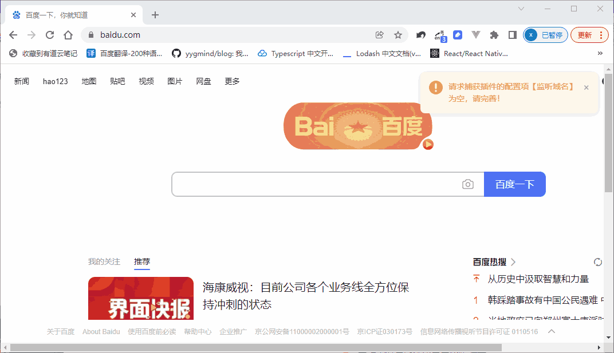

项目仓库地址: [request-retransmission-chrome-extension](https://github.com/zx69/request-retransmission-chrome-extension)

因个人水平有限, 如代码中有bug, 或存在可以优化的内容, 欢迎指正和issue. 如果该项目对你有所帮助,欢迎Star~

这个是功能单一的扩展程序，唯一的技术闪光点是在于使用猴子补丁的方法改写`XMMHttpRequest`，从而实现在扩展程序中获取请求的`responseBody`的逻辑。具体细节在上一篇中已说明，这里再补充一下本扩展程序的安装和使用流程，以便有需求的同学可以直接安装并调试具体代码。对本扩展程序不敢兴趣的同学可跳过本章。

(接上文)


## 使用方法

因为本项目只用于公司内部业务，加上Chrome应用商店没梯子也上不去，所以这个扩展程序没有发布到Chrome应用商店，需通过【开发者模式】安装。具体步骤为：

#### 插件安装

1. 从[github仓库](https://github.com/zx69/request-retransmission-chrome-extension)下载代码到本地并解压。

2.	启动Chrome浏览器，在新标签页的地址栏中输入“`chrome://extensions`”, 回车确人，进入【Chrome扩展程序】界面：

33.	因为本插件不是从Chrome应用商店下载的，所以必须以【开发者模式】加载。打开页面右上角的【开发者模式】开关：

  

此时标题栏下面出现加载选项栏：

4.	点击【加载解压的扩展程序】，弹出选择文件夹对话框.选择步骤一解压的文件夹，如`E:\github\request-retransmission-chrome-extension`, 然后点击【确定】。

5.此时在【扩展程序】界面，可以看得插件已加载到Chrome，且浏览器地址栏右侧将出现插件图标：

  

插件安装完毕。

#### 插件配置：
1. 点击地址栏右侧的扩展程序图标，进入页面配置页。

;

2. 配置表单包含4个配置项，4项均为必填：
  - 【监听域名】：指插件要监听的目标网站的域名（扩展名和具体路径可省略）。配置后，请求拦截脚本将在访问该域名时注入。
  - 【监听URL】：指插件要监听的请求的URL路径（不含域名）。配置后，插件在监听到该请求发出并返回响应时，截取响应内容。
  - 【发送URL】和【请求类型】：指插件获取到目标响应后，要将该响应内容发送的目标请求的Ajax-url和method。

3. 配置后点击保存。至此配置完成。此时当执行相应操作，触发的请求中包含配置的【监听域名】和【监听URL】时，插件将截取响应内容，通过AJAX以【请求类型】发送到【发送URL】配置的请求路径上。

#### 示例：监听WY严选的用户订单列表

1. 登录【严选官网】-【我的订单】，通过Chrome Devtools，识别出严选的订单列表接口为：https://you.163.com/xhr/order/getList.json?xx=xx

2. 在本地开启一个node服务器（或使用`http-server`等开箱即用的服务器包）。这里简单写一下接受逻辑如下：

```javascript
// receive-server/index.js
const http = require('http');
const fs = require('fs');

http.createServer(function(req, res) {
  let bodyStr = '';
  req.on('data', chunk => {
    bodyStr = bodyStr + chunk.toString();
  });
  req.on('end', () => {
    // 数据保存到本地
    fs.writeFileSync(`res-${Date.now()}.json`, bodyStr, 'utf-8');
    res.writeHead(200, {"Content-Type": "application/json"});
    res.end(JSON.stringify({code:200, message: 'receive sucessfully'}));
  })
}).listen(3001);
```
3. 命令行输入`node index.js`启动node服务器监听，接受路径为`http://localhost:3001`;

4. 安装本Chrome扩展程序，步骤如上述【插件安装】和【插件配置】。在配置框输入如下：
  - 【监听域名】: `you.163.com`
  - 【监听URL】: `/xhr/order/getList.json`
  - 【发送URL】: `http://localhost:3001`
  - 【请求类型】: `POST`(大数据量，取POST)

  配置结果如下：

  

5. 重新进入【我的订单】页面，插件会拦截严选的订单接口，并将监听的特定接口的返回值转发到本地的node服务器。转发后页面右上角会出现 “receive successfully” 的预期提示.
  
  

6. 本地的node服务器路径下会出现一个新的写入JSON文件，打开并格式化，可见就是我们原本预期的订单列表数据：


最后再贴另一个拦截豆瓣请求的示例：


## 总结

这个项目是个功能单一的扩展程序，大概细节如上述，具体代码详见仓库。从上述的示例可知，在浏览器上安装扩展程序存在一定的安全隐患，特别是非官方来源的。即使Chrome以及对扩展程序的权限做了种种限制（比如禁止webRequest API读取`responseBody`）,但仍然有漏洞可以钻。像用户订单这么隐私信息都能通过上述方法轻而易举的获取到。所以我们日常使用浏览器最好只从官网下载并安装。

另有一些需注意的点：

1. 由于采用的是改写XMMHttpReques请求，所以只适用于走Ajax方式获取的请求，也就是说后端渲染的页面（前后端未分离、SSR等）无法通过这种方法拦截。上面的例子使用WY严选来作为示范，也是出于这个原因——因为阿里、京东等老牌电商都是后端渲染的，不好拿...

2. 这是个几年前的项目了（大概19年的样子），最近写这篇文章的时候试了一下功能还是正常的，但最近的浏览器兼容性不敢保证。听说最近chrome扩展程序的manifest已经升级到V3了，因为时间有限，没有去做新版迁移，有兴趣的同学可以自己尝试。

3. 最近发现这种需求现在貌似可以借助"油猴(tempermonkey)"来注入脚本实现,不需要专门开发一个扩展程序.当时为啥没用油猴脚本呢？一个是当时好像还没有油猴扩展程序(或者名气还不显,我没听说)，二是商业合作用油猴脚本会给人一直不专业的感觉,还是开发一个扩展程序逼格高.另外扩展程序上可以设置在特定拦截页面高亮, 这样也专业点。

4. 本扩展程序因产品要求，在触发转发时右侧会给出MessageBox进行提醒，以便告知用户我们正在转发他的数据，免得他们担心我们会监听额外的请求。那个弹框写的比较糙，不需要的可以去掉。