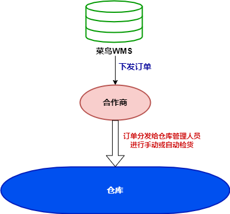
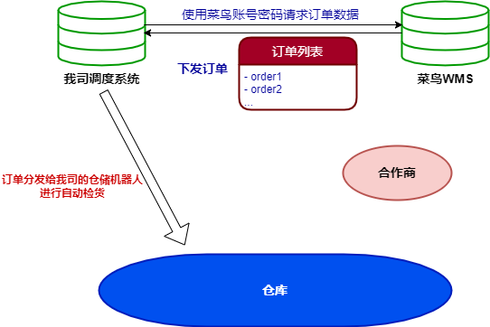
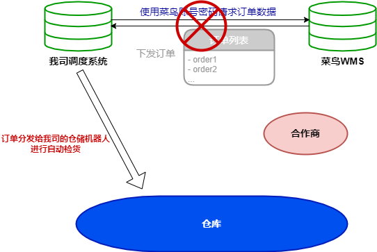
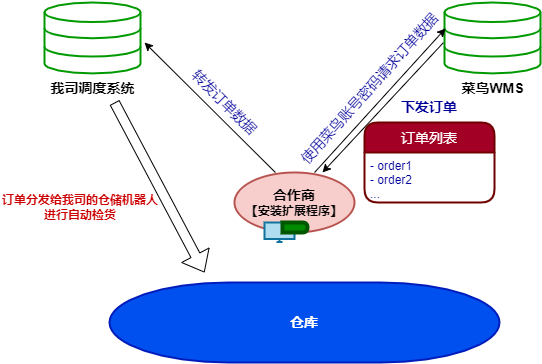
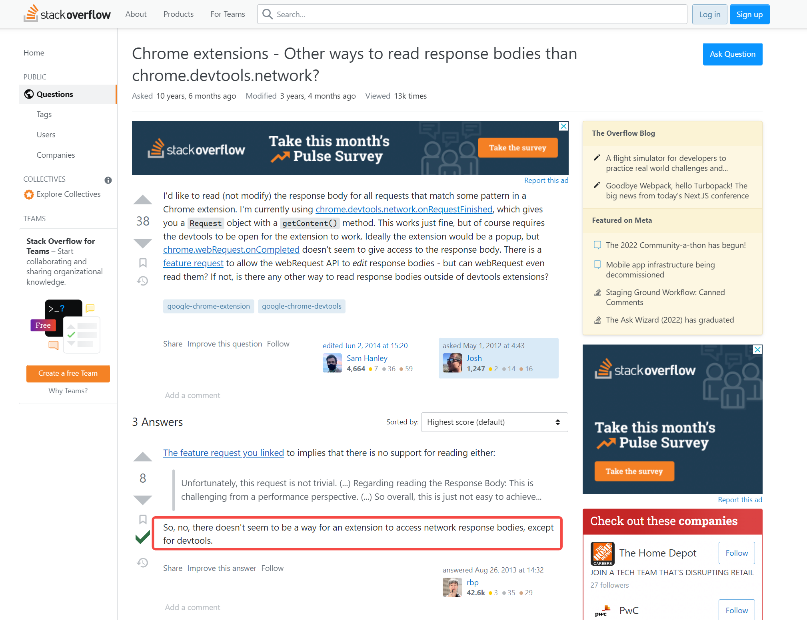

项目仓库地址: [request-retransmission-chrome-extension](https://github.com/zx69/request-retransmission-chrome-extension)

这个是几年前的一个项目. 当时我在一家做智能仓储机器人的公司, 当时我司与一个客户达成初步合作意向, 打算在客户的仓库使用我司的仓储管理方案. 那个客户是菜鸟平台的WMS(仓库管理系统), 原本他们的业务逻辑是:

所以业务上出现一个需求: 需要将菜鸟平台的实时订单推送到我司自身的WMS系统, 然后才好进行数据处理. 

不难想到, 这种情况最简单的解决办法是: 使用菜鸟WMS的账号密码, 调用菜鸟WMS的登录接口, 获取到它的的登录凭证(cookie/session等), 然后用这个凭证直接调用菜鸟WMS的订单列表接口来拉取订单:

但实测发现, 菜鸟WMS的登录认证比想象中的复杂(不愧是大厂出品), 似乎有校验IP或定位之类的机制, 别说通过后端去拉接口, 就连在异地浏览器上按常规流程输入账号密码都无法登录 (隔的时间有点久了, 具体报错记不清了).

所以这个方案否了. 只能另想方案. 

经过商讨, 我们决定先采用一种比较简单粗暴的解决办法来拉取订单进行测试, 等到确定了最终合作意向, 再由合作方去向菜鸟申请专门的账号给我司使用. 该方案如下: 

1. 我司开发一个Chrome扩展程序, 功能是拦截特定域名和链接, 然后转发到另一个链接;
2. 在合作方的电脑上安装该扩展程序, 当操作人员在他们公司操作菜鸟wms时, 该扩展程序将拦截订单列表接口的请求, 并将response转发到我司系统上;
3. 我司系统依据接受到的订单列表中的SKU信息进行后续操作.

> 这种需求现在其实可以借助"油猴"来注入脚本实现,不需要专门开发一个扩展程序.当时为啥没用油猴脚本:
> 1. 当时好像还没有油猴扩展程序(或者名气还不显,我没听说)
> 2. 这种商业合作用油猴脚本会给人一直不专业的感觉,还是开发一个扩展程序逼格高.另外扩展程序上可以设置在特定拦截页面高亮, 这样也专业点

这样功能相对单一的扩展程序, 本身并不复杂, 那就开搞吧.然而实际开发时很快就遇到了一个巨大的卡点: chrome扩展程序的[webRequest - API](https://developer.chrome.com/docs/extensions/reference/webRequest/), 压根不支持获取 responseBody(吐血)! 能获取到responseHeaders/requestBody, 能获取到response statusCode, 但偏偏没有把responseBody暴露出来. 原因不难猜, 估计是又出于安全的考虑了.

折中方式当前也有, 就是开启

